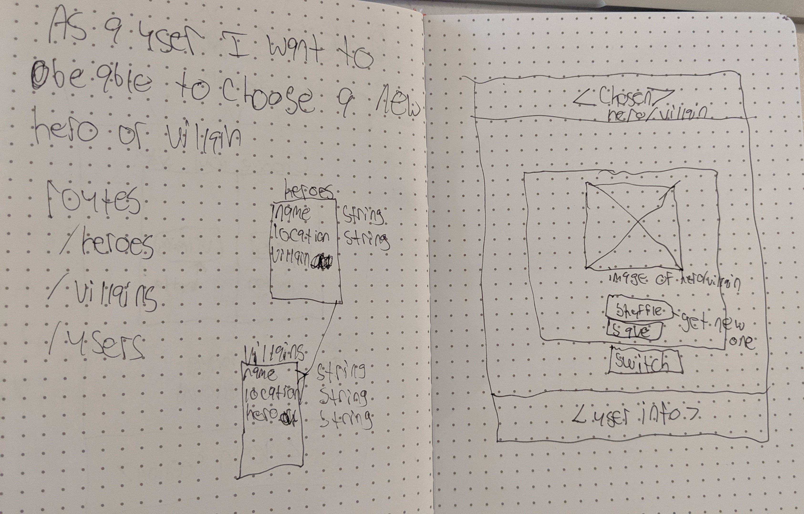

## Serve-A-Hero

* * *
## _Description_:
A rails api built with ruby for my SPA [Serve-A-Hero](https://github.com/cclancy97/Serve-A-Hero), it has RESTful routes and here is my [Deployed-Site](https://cclancy97.github.io/Serve-A-Hero/)

***
## _ERD_:

## 

* * *
## _Technologies used_:
  - Ruby
* * *

## _Future Versions_:
I would like to add a villains table and have a relationship to villains as their 'arch-enemy'
***

## _Planning_:
- Built resource table and tested w/curl scripts
- Connected frontend to backend
- Added authentication
- Added requests to api from the frontend
- Styled
